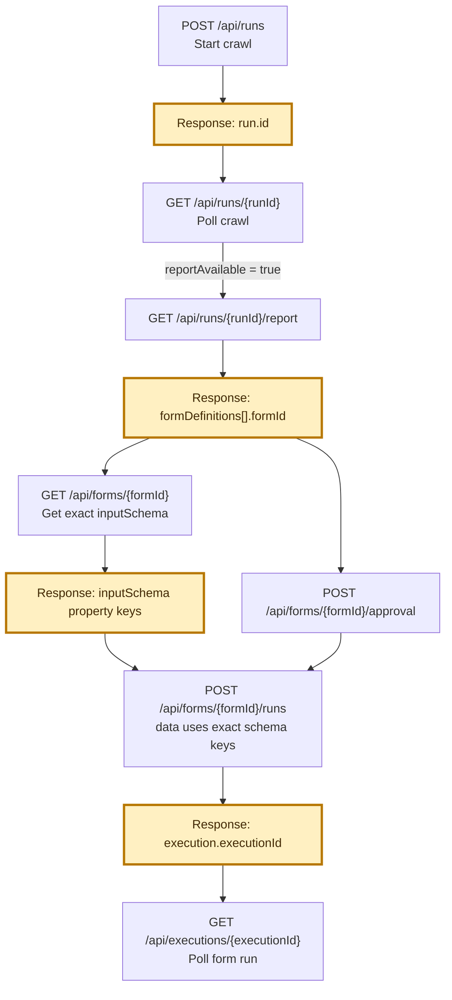

# FormWeave API client quick start

This guide shows the standard client workflow:

1. start a crawl;
2. poll the crawl;
3. retrieve and review the report, schema, and screenshots;
4. approve the exact crawled form;
5. start a form run with client data;
6. poll the form run and interpret the result.

Use the FormWeave base URL supplied for your environment. Examples below use:

```text
<FORMWEAVE_BASE_URL>
```

## Authentication

Every `/api/*` request requires a Bearer token issued for the client
environment:

```http
Authorization: Bearer <FORMWEAVE_API_TOKEN>
```

The token is a secret. Send it only from server-side code over HTTPS; never
embed it in a browser bundle, mobile application, URL, query parameter, or
log. A `401 authentication_required` response means the header was missing,
expired, revoked, or invalid. A `429 authentication_locked` response means
repeated invalid authentication attempts temporarily locked that principal.
The focused OpenAPI contracts linked below define the same Bearer scheme.

On the hosted staging service, Bearer tokens and regular operator accounts may
start crawls and approved form runs only on the exact
`https://testforms.dbolab.io` origin. Other public origins return
`403 external_target_access_required` and require the designated administrator's
user session or Basic credentials. API tokens never inherit that user-only
privilege.

## What a client needs

Before integrating, the client needs:

- the FormWeave base URL for its environment;
- a server-side FormWeave Bearer token;
- a public target-form URL, or explicit loopback authority for a test fixture;
- the ability to retain and pass opaque IDs between calls;
- a reviewer identity for form approval;
- the ability to construct user-input fields from JSON Schema;
- a polling mechanism for asynchronous crawl and form-run status.

The examples in this guide show the complete common-path workflow but
intentionally omit uncommon optional properties and some extended response
metadata. Each operation links to its focused OpenAPI contract. Use those
contracts as the authoritative source for every supported field, enum, HTTP
response, and error shape when generating a client or handling a less common
case.

Safe retries matter:

- status, report, schema, screenshot, and execution `GET` requests are
  read-only and may be retried;
- retrying `POST /api/runs` creates another crawl and another `run.id`;
- retrying `POST /api/forms/{formId}/runs` creates another execution and may
  risk a duplicate submission if the first execution reached the target;
- if a POST response is lost before its generated ID is received, treat the
  outcome as ambiguous and require operator reconciliation instead of blindly
  creating another operation.

## ID and payload flow

The highlighted values must be carried into later calls. Treat them as opaque
server-generated identifiers; do not create or modify them.



| Value | Produced by | Used by |
| --- | --- | --- |
| `run.id` | Start crawl | Crawl polling and report retrieval |
| `formDefinitions[].formId` | Crawl report | Schema retrieval, approval, and form runs |
| `form.inputSchema` property keys | Form schema | Keys and validation rules for the run `data` object |
| `execution.executionId` | Start form run | Form-run status polling |

Every recrawl creates a new `run.id` and new crawl-scoped `formId`. Approval of
an older `formId` does not approve a newer crawl.

## 1. Start a crawl

```http
POST <FORMWEAVE_BASE_URL>/api/runs
Content-Type: application/json
```

Example request (common path):

```json
{
  "urls": ["https://example.org/application"],
  "name": "Example application",
  "mode": "probe",
  "submit": false,
  "browserMode": "headless",
  "allowLocalTargets": false,
  "componentAuthorities": {
    "consent": false,
    "signature": false,
    "upload": false,
    "acknowledgement": false,
    "reviewConfirmation": false
  }
}
```

Request fields:

| Field | Required | Meaning |
| --- | --- | --- |
| `urls` | Yes | Exactly one HTTP or HTTPS starting URL. The LLM may select one observed action from that page to reach one resource-access form. |
| `name` | No | Client-facing crawl label. It is not artifact identity. |
| `mode` | No | Compatibility field; send `probe`. Legacy `fixture_submit` is accepted as an alias for `submit: true`. |
| `submit` | No | `false` traverses and verifies synthetic values but blocks the terminal action. `true` explicitly activates the LLM-authored terminal action and verifies the resulting state for either a public target or an allowed localhost target. |
| `browserMode` | No | `headless` or `headful`; defaults to `headless`. Hosted service deployments accept only `headless`; `headful` opens a visible browser only when FormWeave itself runs on the operator's workstation. |
| `allowLocalTargets` | No | Must be `true` for loopback targets on a local FormWeave server. Hosted deployments reject it because their localhost is the remote worker, not the client's computer. It never allows other private networks. |
| `componentAuthorities` | No | Fresh per-crawl permission to model consent, signature, upload, acknowledgement, or review-confirmation controls with synthetic values. These flags do not authorize terminal submission; use `submit` for that. |

Each crawl is limited to one form journey. FormWeave does not heuristically
GET-crawl related same-site pages or collect alternate forms. When the supplied
URL is a landing page, the LLM may author one exact observed navigation action
at a time toward the form that most directly enables access to an essential
service. It prioritizes intake, application, enrollment, service-request,
referral, eligibility, and direct-access registration forms; a contact or
request-information form is the fallback when no direct service-access form is
available.

Example response: `201 Created`

```json
{
  "run": {
    "id": "run_8c3f09d1865c4f",
    "crawlId": "run_8c3f09d1865c4f",
    "status": "running",
    "stage": "Queued for local browser crawl",
    "progress": 2,
    "submit": false,
    "reportAvailable": false
  }
}
```

Critical response field:

- Save `run.id`. The API console may call it the **Run ID** or **Crawl ID**.
  `crawlId` is an alias, but clients should consistently use `run.id`.

`201 Created` means the crawl was accepted and started asynchronously. It does
not mean crawling or script generation succeeded.

Full contract: [Kick Off Crawl](./openapi-crawl-start.json).

## 2. Poll the crawl

Pass the exact `run.id` returned above:

```http
GET <FORMWEAVE_BASE_URL>/api/runs/run_8c3f09d1865c4f
```

Example in-progress response:

```json
{
  "run": {
    "id": "run_8c3f09d1865c4f",
    "status": "running",
    "stage": "Generating and verifying form script",
    "progress": 68,
    "reportAvailable": false,
    "formIds": []
  }
}
```

Example terminal response:

```json
{
  "run": {
    "id": "run_8c3f09d1865c4f",
    "status": "awaiting_review",
    "stage": "Scripted traversal needs human review",
    "progress": 100,
    "reportAvailable": true,
    "formIds": ["form_5b6288d171cb4f23a87d39e9"],
    "findings": [
      {
        "code": "crawl_finished",
        "title": "Form traversal captured",
        "detail": "Report and evidence are available."
      }
    ]
  }
}
```

Poll while `status` is `queued` or `running`. Stop polling when it becomes one
of:

- `completed`
- `awaiting_review`
- `disqualified`
- `failed`

Critical response fields:

| Field | What the client should do |
| --- | --- |
| `status` | Determines whether to keep polling and whether the crawl may proceed to review. |
| `progress` | Display only; do not treat `100` alone as success. |
| `reportAvailable` | Fetch the report only when this is `true`. |
| `formIds` | Candidate crawl-scoped form IDs. Confirm the intended form in the report. |
| `stage` | Human-readable current stage or failure summary. |
| `findings[].code` | Machine-readable diagnostics such as `quality_floor`, `script_missing`, `challenge_detected`, or `cross_page_branching`. |

A `failed` crawl may have no report or form ID. A `disqualified` crawl may have
a report for inspection but cannot be approved for execution.

Full contract: [Check Crawl](./openapi-crawl-status.json).

## 3. Get the report, schema, and screenshots

### 3.1 Get the report

```http
GET <FORMWEAVE_BASE_URL>/api/runs/run_8c3f09d1865c4f/report
```

Example response (abbreviated):

```json
{
  "id": "run_8c3f09d1865c4f",
  "stats": {
    "pagesFetched": 3,
    "formsFound": 1,
    "fieldsFound": 14,
    "screenshotsCaptured": 9,
    "fieldsEntered": 14,
    "entryFailures": 0
  },
  "runnerJourney": {
    "available": true,
    "source": "llm_authored_script",
    "artifactId": "form_artifact_243a",
    "scriptVersion": 1,
    "summary": "The approved runner will follow 3 ordered states, complete 14 modeled fields, advance 2 times, and reach 1 terminal submission action.",
    "steps": [
      {
        "sequence": 1,
        "type": "state",
        "title": "Applicant contact information",
        "fields": [
          {
            "key": "full_name",
            "instruction": "Enter the submitted value for “Full name” (required)."
          }
        ],
        "progression": {
          "kind": "advance",
          "label": "Next",
          "instruction": "After completing the fields above, select “Next” to continue to the next state."
        }
      },
      {
        "sequence": 3,
        "type": "state",
        "title": "Review and submit",
        "progression": {
          "kind": "terminal_submit",
          "label": "Submit application",
          "instruction": "Select “Submit application” to submit the completed form."
        }
      }
    ]
  },
  "contract": [
    {
      "key": "full_name",
      "label": "Full name",
      "control": "text",
      "required": true
    }
  ],
  "pages": [
    {
      "title": "Application",
      "stateEvidence": [
        {
          "id": "page_01_state_02_populated",
          "kind": "populated",
          "evidenceAvailable": true,
          "evidence": "/api/runs/run_8c3f09d1865c4f/evidence/page_01_state_02_populated"
        }
      ]
    }
  ],
  "formDefinitions": [
    {
      "formId": "form_5b6288d171cb4f23a87d39e9",
      "title": "Example application",
      "targetUrl": "https://example.org/application",
      "status": "observed",
      "eligibility": {
        "status": "eligible",
        "reasons": []
      },
      "script": {
        "artifactId": "form_artifact_243a",
        "scriptVersion": 1,
        "sourceHash": "7dd57f..."
      }
    }
  ],
  "findings": []
}
```

Critical report fields:

| Field | Why it matters |
| --- | --- |
| `formDefinitions[].formId` | Select the intended form and pass this exact ID to schema, approval, and run calls. |
| `formDefinitions[].targetUrl` | Confirms which discovered form the ID represents. |
| `formDefinitions[].eligibility.status` | Must be `eligible` before approval. |
| `formDefinitions[].script` | Identifies the generated script that approval will pin. |
| `runnerJourney` | Review the ordered, human-readable actions the approved runner will replay. It is derived from the retained LLM-authored script and includes fields, conditional groups, Next/Continue controls, and terminal Submit. `available=false` means there is no executable script to approve. |
| `contract` | Review detected fields, labels, types, options, required status, and sensitive classifications. |
| `pages` and state flow | Confirm that traversal reached all supported states and stopped at the intended boundary. |
| `pages[].stateEvidence` | Contains screenshot URLs and evidence metadata for populated states and transitions. |
| `findings` | Review warnings, blockers, incomplete coverage, and disqualifying conditions. |
| `stats.entryFailures` | Nonzero values require investigation before approval. |

Do not automatically select the first form definition when a report contains
multiple forms. Match the intended `targetUrl`, title, eligibility, and flow.

### 3.2 Get screenshot evidence

Use the exact relative URL returned in an evidence record:

```http
GET <FORMWEAVE_BASE_URL>/api/runs/run_8c3f09d1865c4f/evidence/page_01_state_02_populated
```

The response body is PNG, JPEG, or WebP image data. It is not JSON.

Evidence should demonstrate entered values and a successful state transition,
not merely that the page rendered.

### 3.3 Get the exact form schema

Pass the selected `formId`:

```http
GET <FORMWEAVE_BASE_URL>/api/forms/form_5b6288d171cb4f23a87d39e9
```

Example response (abbreviated):

```json
{
  "form": {
    "formId": "form_5b6288d171cb4f23a87d39e9",
    "status": "observed",
    "eligibility": {
      "status": "eligible",
      "reasons": []
    },
    "script": {
      "artifactId": "form_artifact_243a",
      "scriptVersion": 1,
      "sourceHash": "7dd57f..."
    },
    "approval": null,
    "inputSchema": {
      "x-formweave-contract-version": 3,
      "x-formweave-test-data": {
        "full_name": "FORMWEAVE TEST PERSON",
        "date_of_birth": "1980-12-14",
        "housing_type": "Rent",
        "landlord_name": "FORMWEAVE TEST LANDLORD"
      },
      "x-formweave-test-data-purpose": "Synthetic values used to validate the pinned crawl-generated script. They are debugging and approval aids, not real applicant data.",
      "type": "object",
      "properties": {
        "full_name": {
          "type": "string",
          "x-formweave-label": "Full name",
          "x-formweave-native-name": "full_name",
          "x-formweave-test-value": "FORMWEAVE TEST PERSON",
          "x-formweave-test-value-source": "llm-authored-generated-script"
        },
        "date_of_birth": {
          "type": "string",
          "format": "date",
          "x-formweave-label": "Date of birth",
          "x-formweave-control": "date",
          "x-formweave-native-name": "dob",
          "x-formweave-input-format": "YYYY-MM-DD"
        },
        "housing_type": {
          "type": "string",
          "enum": ["Rent", "Own"],
          "x-formweave-label": "Housing type"
        },
        "landlord_name": {
          "type": "string",
          "x-formweave-label": "Landlord name",
          "x-formweave-branch": {
            "fieldKey": "housing_type",
            "value": "Rent",
            "classification": "same_page_branch"
          }
        }
      },
      "required": ["full_name", "housing_type"],
      "allOf": [
        {
          "if": {
            "properties": {
              "housing_type": {
                "const": "Rent"
              }
            },
            "required": ["housing_type"]
          },
          "then": {
            "required": ["landlord_name"]
          }
        }
      ],
      "additionalProperties": false
    }
  }
}
```

Critical schema fields:

- `inputSchema.x-formweave-test-data` is a ready-to-edit synthetic `data`
  payload containing the values used to validate the pinned crawl script.
  It is useful for approval, debugging, and a first dry run; it is not real
  applicant data and does not itself authorize submission.
- Each populated property repeats its value in `x-formweave-test-value` and
  identifies its origin in `x-formweave-test-value-source`. This lets clients
  show which individual fields were initialized from crawl validation.
- Use the exact keys under `inputSchema.properties` in the future `data`
  object.
- Enforce each property’s `type`, `enum`, `pattern`, and numeric or length
  limits.
- Enforce the base `required` list.
- Treat `format: date` as `YYYY-MM-DD`. Browser-native `datetime-local`,
  `month`, `week`, and `time` controls expose their exact wire encoding in
  `x-formweave-input-format`.
- Enforce numeric `multipleOf` when the crawled control declared a step size.
- Evaluate conditional requirements in `allOf`.
- Use `x-formweave-label` and `x-formweave-control` to render client fields.
- Use `x-formweave-options` when a client needs both the submitted option value
  and its human-readable label.
- Use `x-formweave-browser-constraints` for observed placeholder,
  autocomplete, input-mode, min/max, step, and multiple-value hints.
- `x-formweave-native-name` is informational for audit and fixture-capture
  comparison. Continue sending the semantic property key in Run API `data`.
- Use `x-formweave-branch` to show only fields active for the selected branch.
- Observe sensitivity and legal-acceptance annotations returned on properties.
- Send a file field as:

```json
{
  "filename": "supporting-document.pdf",
  "contentType": "application/pdf",
  "contentBase64": "JVBERi0xLjQK..."
}
```

Never combine a `formId` from one crawl with a schema from another crawl.

Full contract:
[Get Report, Schema, and Screenshots](./openapi-crawl-artifacts.json).

## 4. Approve or reject the crawled form

Approval applies to one exact `formId` and pins its generated-script identity.

```http
POST <FORMWEAVE_BASE_URL>/api/forms/form_5b6288d171cb4f23a87d39e9/approval
Content-Type: application/json
```

Example request (common path):

```json
{
  "decision": "approved",
  "actor": "reviewer@example.org",
  "notes": "Schema, flow, eligibility, and transition evidence reviewed."
}
```

Request fields:

| Field | Required | Meaning |
| --- | --- | --- |
| `decision` | Yes | `approved` or `rejected`. |
| `actor` | No | Reviewer identity. Defaults to `local-operator` if omitted. |
| `notes` | No | Review notes retained with the decision. |

Example response:

```json
{
  "form": {
    "formId": "form_5b6288d171cb4f23a87d39e9",
    "status": "approved",
    "approval": {
      "approvalId": "approval_3013e759afbe423f80314122513203b4",
      "decision": "approved",
      "actor": "reviewer@example.org",
      "pinnedScript": {
        "artifactId": "form_artifact_243a",
        "scriptVersion": 1,
        "sourceHash": "7dd57f..."
      }
    }
  },
  "approval": {
    "approvalId": "approval_3013e759afbe423f80314122513203b4",
    "decision": "approved",
    "actor": "reviewer@example.org",
    "pinnedScript": {
      "artifactId": "form_artifact_243a",
      "scriptVersion": 1,
      "sourceHash": "7dd57f..."
    }
  }
}
```

Critical response fields:

- Confirm `form.formId` matches the reviewed form.
- Confirm `form.status` and `approval.decision` are `approved`.
- `approval.approvalId` is an audit identifier. The client does not pass it
  into the run call.
- `approval.pinnedScript` shows the immutable script identity authorized by
  this decision.

Reapprove after every recrawl because the new crawl produces a new `formId`.

Full contract:
[Approve or Reject Form](./openapi-form-approval.json).

## 5. Start a form run

Pass the approved `formId`. Build `data` from that exact form’s `inputSchema`.

```http
POST <FORMWEAVE_BASE_URL>/api/forms/form_5b6288d171cb4f23a87d39e9/runs
Content-Type: application/json
```

Example request (common path):

```json
{
  "data": {
    "full_name": "Alex Example",
    "housing_type": "Rent",
    "landlord_name": "Example Property Management"
  },
  "submit": true,
  "browserMode": "headless"
}
```

Request fields:

| Field | Required | Meaning |
| --- | --- | --- |
| `data` | Yes | Values keyed exactly by `inputSchema.properties`. |
| `submit` | Yes | `false` populates and verifies without terminal submission. `true` authorizes the pinned terminal submit action. |
| `browserMode` | No | `headless` or `headful`; defaults to `headless`. |

Example response: `201 Created`

```json
{
  "execution": {
    "executionId": "exec_2082914c56194509b646f30a26de1a23",
    "formId": "form_5b6288d171cb4f23a87d39e9",
    "status": "running",
    "outcome": "pending",
    "submit": true,
    "fieldsAttempted": 0,
    "fieldsVerified": 0,
    "fieldsFailed": 0,
    "submitted": false
  }
}
```

Critical response field:

- Save `execution.executionId`. It identifies this individual form-run attempt
  and is required for status polling.

`201 Created` means execution was queued. It does not prove that fields were
populated or that submission succeeded.

Common request failures:

| HTTP status/code | Meaning |
| --- | --- |
| `400` | `data` or `submit` has an invalid top-level shape. |
| `404` | The `formId` does not exist. |
| `409 form_not_approved` | This exact crawl-scoped form was not approved. |
| `409 approval_version_mismatch` | Approval does not pin the form’s current immutable script identity. |

Full contract: [Kick Off Form Run](./openapi-form-run.json).

## 6. Poll the form run

Pass the exact `execution.executionId` returned above:

```http
GET <FORMWEAVE_BASE_URL>/api/executions/exec_2082914c56194509b646f30a26de1a23
```

Poll while `execution.status` is `queued` or `running`.

Example successful-submission response:

```json
{
  "execution": {
    "executionId": "exec_2082914c56194509b646f30a26de1a23",
    "formId": "form_5b6288d171cb4f23a87d39e9",
    "status": "completed",
    "outcome": "submission_verified",
    "fieldsAttempted": 3,
    "fieldsVerified": 3,
    "fieldsFailed": 0,
    "submitted": true,
    "submissionResult": {
      "verified": true,
      "outcome": "success",
      "detail": "Configured success markers were present in the rendered result."
    },
    "issues": [],
    "failureCode": null,
    "detail": "Submission success was verified."
  }
}
```

Example failed response:

```json
{
  "execution": {
    "executionId": "exec_2082914c56194509b646f30a26de1a23",
    "formId": "form_5b6288d171cb4f23a87d39e9",
    "status": "failed",
    "outcome": "failed",
    "fieldsAttempted": 3,
    "fieldsVerified": 2,
    "fieldsFailed": 1,
    "submitted": false,
    "submissionResult": null,
    "issues": [
      {
        "fieldKey": "landlord_name",
        "code": "actuation_unverified",
        "detail": "The scripted field action could not be verified."
      }
    ],
    "failureCode": "actuation_unverified",
    "detail": "One field failed browser readback."
  }
}
```

Critical response fields:

| Field | How to interpret it |
| --- | --- |
| `status` | `completed` or `failed` is terminal. |
| `outcome` | High-level result, such as `dry_run_completed` or `submission_verified`. |
| `fieldsAttempted`, `fieldsVerified`, `fieldsFailed` | Verify that expected field actuation was complete. |
| `submitted` | Indicates that the terminal action was activated; it does not alone prove success. |
| `submissionResult.verified` | Must be `true` before treating a submitted form as successfully completed. |
| `issues` | Field-level or action-level diagnostics. |
| `failureCode` | Primary machine-readable failure classification. |
| `detail` | Human-readable explanation. |

For a live submission, treat the run as successful only when all three are
true:

```text
execution.status == "completed"
execution.outcome == "submission_verified"
execution.submissionResult.verified == true
```

Do not blindly retry when `submitted` is `true` but submission verification
failed; the target may have received the form.

Common terminal failure codes include:

- `validation_blocked`
- `challenge_detected`
- `actuation_unverified`
- `cross_page_branching`
- `advance_no_navigation`
- `terminal_submission_unverified`
- `execution_error`

The execution response does not return supplied field values. It records field
keys and explicitly reports that sensitive input was not persisted.

Full contract: [Check Form Run](./openapi-execution-status.json).

## Client completion checklist

A basic client integration is complete when it can:

- start a crawl and retain `run.id`;
- poll that exact run until a terminal crawl status;
- require `reportAvailable = true` before requesting the report;
- select the intended `formDefinitions[].formId`, rather than assuming the
  first discovered form;
- display or otherwise review the contract, flow, findings, and screenshot
  evidence;
- retrieve the exact form’s `inputSchema` and render its required,
  conditional, enum, branch, consent, signature, and file fields;
- approve or reject the same `formId` that was reviewed;
- construct run `data` using only the exact schema keys and valid value shapes;
- explicitly choose whether `submit` is `false` or `true`;
- retain `execution.executionId` and poll that exact execution;
- treat live submission as successful only when `status`, `outcome`, and
  `submissionResult.verified` all satisfy the success conditions above;
- surface `issues`, `failureCode`, and `detail` when a crawl or execution does
  not succeed.

## OpenAPI contracts

- [Kick Off Crawl](./openapi-crawl-start.json)
- [Check Crawl](./openapi-crawl-status.json)
- [Get Report, Schema, and Screenshots](./openapi-crawl-artifacts.json)
- [Approve or Reject Form](./openapi-form-approval.json)
- [Kick Off Form Run](./openapi-form-run.json)
- [Check Form Run](./openapi-execution-status.json)
