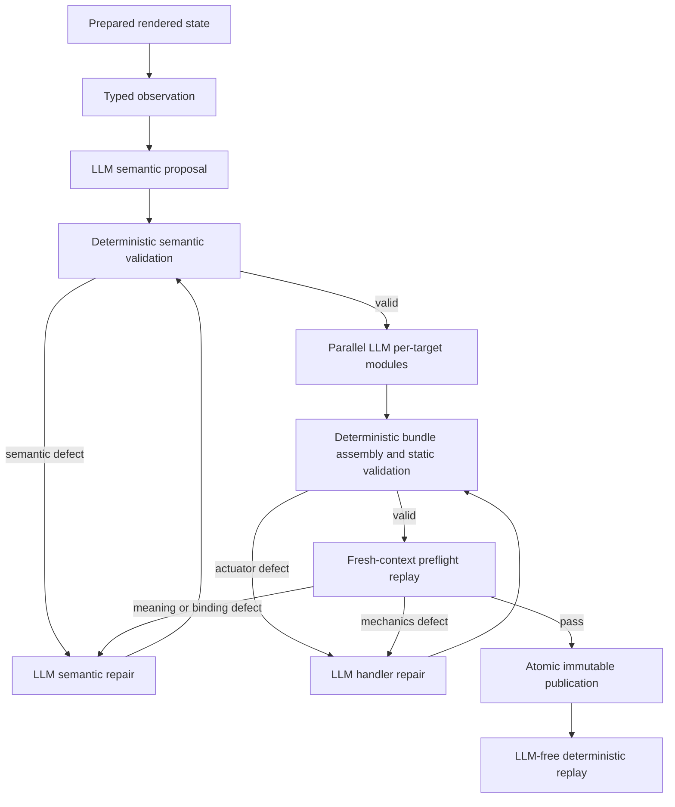

# IntakeCR semantic-plan and per-site actuator repair proposal

| Document field | Value |
| --- | --- |
| Status | Implemented foundation; production default is enforced generated handlers |
| Proposal version | `0.1.0` |
| Written | 2026-08-03 |
| Scope | Remaining semantic generation, per-site actuation, repair, persistence, and failure-reporting work |
| Governing requirements | `FEATURES_CONTRACT_V2.md`, especially D1-D3 and F13-F16 |

## 1. Implemented outcome

Split form automation into two separately generated and separately repairable
artifacts:

1. A **semantic plan** states what the rendered form means: fields, actions,
   grouping, constraints, source-fact bindings, dependencies, progression,
   protected actions, and expected verification.
2. A **per-site actuator bundle** states how to perform each semantic field or
   action on that specific rendered application using Playwright.

The executor sequences typed semantic commands, owns browser lifecycle and
safety, and records evidence. It does not learn site-specific interaction
techniques and does not hard-code labels, field names, hostnames, selectors,
or application-specific exceptions.

Repair is bidirectional. The LLM may revise the semantic plan when meaning or
binding is wrong, revise an actuator handler when interaction mechanics are
wrong, or revise both when evidence proves a cross-layer defect. An actuator
failure does not force an actuator-only repair.

Only the final validated semantic-plan/actuator pair is eligible for replay or
publication. Failed candidates are retained for diagnosis but are not run in
sequence against a live user session.

Implementation note (2026-08-03): strict schemas, typed semantic repair,
defect routing, the capability-limited runtime, AST validation, immutable
readable modules, PostgreSQL persistence, preflight/publication records, and
truthful failure counters are implemented. Candidates are persisted before
browser preflight, and `FORMWEAVE_ACTUATOR_MODE=enforced` routes production
commands through the generated handlers. `shadow` remains diagnostic-only and
the existing corpus must still be rerun in enforced mode before parity is
claimed.

## 2. Current baseline and gap

The current implementation already has useful pieces that should be retained:

- rich DOM, accessibility, frame, screenshot, and history observations;
- a strict LLM-produced semantic proposal;
- deterministic schema, source-fact, coverage, safety, and locator checks;
- bounded semantic regeneration with validation feedback and history;
- immutable hashes and versions;
- PostgreSQL storage for JSON, source text, events, images, and other blobs;
- shared browser preparation, one-run concurrency, bounded probing, process
  cleanup, and browser-layer submission controls.

The main architectural gap is that the current generated module is primarily
a base64-encoded serialization of the semantic plan. Shared runtime code still
owns most field interaction mechanics. It is hashed and reproducible, but its
on-disk representation is not naturally human-readable and it is not the
per-site executable actuator required by D1.

The current repair loop also regenerates a complete semantic proposal. It does
not have a typed semantic repair artifact, independently replaceable actuator
handlers, or a defect router that can move a failed actuator candidate back to
semantic repair.

Finally, a pre-actuation validation failure is currently capable of being
reported as one failed field action per planned field, even though no field was
attempted. Evidence can also be labeled as populated when it is only an
observation of a blocked state. That reporting defect is included in this
proposal.

This proposal does not redo the browser-priming, normalized readback,
choice-probe carve-outs, one-run concurrency, process cleanup, PostgreSQL
foundation, or image persistence work that is already present.

## 3. Non-negotiable boundaries

1. **Meaning belongs to the semantic layer.** The LLM may define and repair
   semantics during generation or repair, never during deterministic real-data
   execution.
2. **Nuanced interaction belongs to the per-site actuator.** Custom widgets,
   nested frames, shadow roots, masks, event ordering, and site-specific waits
   are handled by generated handlers, not shared exceptions.
3. **The protocol is semantic and typed.** The executor sends field/action
   commands and receives structured outcomes. Raw DOM functions, locators, or
   arbitrary Playwright snippets do not cross the runtime protocol.
4. **The executor owns policy and lifecycle.** It owns browser/context/page
   creation and closure, timeouts, concurrency, navigation/network guards,
   terminal-action authority, upload bytes, evidence, redaction, persistence,
   and result aggregation.
5. **No site-specific shared code.** Adding a target must not add hostname,
   label, selector, widget-library, or known-answer branches to the framework.
6. **No live improvisation.** Published replay uses the pinned semantic plan
   and actuator bundle with the LLM disabled.
7. **No in-place artifact mutation.** Every accepted repair creates a new
   candidate and, after validation, a new immutable version.
8. **No source-line patch protocol.** Repairs replace typed semantic elements,
   complete handlers, or shared modules within a bundle. Line-number diffs are
   too brittle for model-generated code.

## 4. Target architecture



The generated files are modules, not a series of repair scripts. Initial
generation uses one bounded model call per semantic target with bounded
concurrency. Deterministic code binds each module to its validated target and
assembles the site bundle. The executor loads one validated bundle and invokes
its handlers in semantic-plan order. Earlier failed handler versions remain
audit records only.

## 5. Artifact model

| Artifact | Purpose | Produced by | Mutability |
| --- | --- | --- | --- |
| Observation | Rendered DOM/accessibility/frame/screenshot facts | Shared sensing | Immutable |
| Semantic candidate | Meaning, bindings, fields, actions, states, dependencies | LLM | Replaced by candidate revision |
| Semantic repair | Typed changes and rationale tied to validation issues | LLM | Immutable attempt |
| Actuator candidate | Per-site modules and handler manifest | LLM-assisted generation | Replaced by candidate revision |
| Actuator repair | Complete handler/module replacements tied to issues | LLM | Immutable attempt |
| Validation run | Static, semantic, safety, and preflight results | Deterministic framework | Immutable |
| Release | Exact compatible semantic and actuator hashes | Publication transaction | Immutable |
| Runtime envelope | Attempts, verification, progression, evidence, faults | Actuator plus executor | Immutable |

Hashes verify content; they do not replace content. Store semantic JSON as
JSONB, store formatted canonical JSON for inspection where useful, and store
actuator JavaScript as ordinary human-readable text. The UI should show both
the content and its hash.

## 6. Semantic plan contract

The plan remains code-free. It uses stable semantic keys and explicit
observation provenance. A simplified field shape is:

```json
{
  "fieldKey": "field_01",
  "meaning": "model-authored description",
  "controlKind": "text",
  "sourceFactIds": ["control_fact_17"],
  "groupKey": null,
  "requiredRule": { "kind": "always" },
  "constraints": {
    "minLength": null,
    "maxLength": 10,
    "pattern": null
  },
  "options": [],
  "dependencies": [],
  "verification": {
    "kind": "normalized_readback"
  }
}
```

The full schema must represent:

- states, sections, guidance, fields, composite fields, and typed actions;
- exact source-fact bindings and observation fingerprint;
- native and model-interpreted constraints, with provenance kept distinct;
- option identity, displayed labels, submitted values, and grouping;
- branch visibility and requiredness rules;
- progression and terminal semantics;
- protected-action classification;
- synthetic probe values and expected verification type;
- lineage to prior semantic versions and repair attempts.

Selectors may remain as observation-derived generation hints, but they are not
the runtime interface and are not authoritative over the live page.

## 7. Per-site actuator bundle contract

An actuator bundle is a versioned manifest plus readable ESM source modules.
It is scoped to one semantic candidate and one observed target lineage.

Recommended handler boundaries are:

- `prepareState` for site-specific readiness after shared page preparation;
- `setField` and `readField` for a semantic field or composite field;
- `executeAction` for disclosure, advance, or other typed actions;
- `observeTransition` when a site needs special handling to expose raw
  transition facts;
- bundle-local shared helpers used by multiple handlers.

A handler can own a composite control when one semantic value maps to several
DOM controls. It need not be artificially split into one file per DOM node.
Every semantic field and action must nevertheless map to an independently
addressable handler ID.

Example manifest entry:

```json
{
  "handlerId": "field_01_handler",
  "targetKind": "field",
  "targetKey": "field_01",
  "operations": ["set", "read"],
  "modulePath": "handlers/field_01.mjs",
  "exportName": "handler",
  "capabilities": ["locator", "frame", "keyboard", "pointer"],
  "sourceFactIds": ["control_fact_17"]
}
```

The generation request should contain the validated semantic plan, relevant
observation facts and screenshot, the allowed capability API, validator
requirements, and—during repair—the exact prior handler, issue list,
preflight evidence, and immutable failure history. It must not contain fixture
answers, target-specific framework rules, secrets, or real applicant data.

## 8. Runtime command and result protocol

The executor invokes a handler through a strict command:

```json
{
  "protocolVersion": 1,
  "invocationId": "invoke_01",
  "releaseId": "release_01",
  "semanticVersion": 3,
  "actuatorVersion": 5,
  "stateKey": "state_01",
  "targetKind": "field",
  "targetKey": "field_01",
  "operation": "set",
  "value": "synthetic-or-user-value",
  "mode": "validation_replay",
  "directive": {
    "progressionPermission": "forbidden"
  }
}
```

The actuator returns a strict result without returning executable objects:

```json
{
  "protocolVersion": 1,
  "invocationId": "invoke_01",
  "handlerId": "field_01_handler",
  "attempted": true,
  "status": "verified",
  "resolved": true,
  "entered": true,
  "verified": true,
  "normalizedReadback": "syntheticoruservalue",
  "stateChanged": false,
  "failureCode": null,
  "detail": null,
  "beforeObservationRef": "observation://before_01",
  "afterObservationRef": "observation://after_01",
  "diagnostics": []
}
```

The executor validates this envelope, independently captures evidence and
browser state, and enforces policy. The handler owns the site-specific method
of resolution, interaction, and readback. The framework may apply universal
DOM/ARIA checks when available, but a missing generic check must not cause it
to invent site-specific behavior.

## 9. Repair model

### 9.1 Defect classification

| Defect class | Examples | Repair target |
| --- | --- | --- |
| Semantic binding | Wrong or missing source-fact ID; one observed control assigned to the wrong semantic field | Semantic plan |
| Semantic meaning | Wrong grouping, control/action classification, options, constraints, dependency, or progression meaning | Semantic plan |
| Actuator mechanics | Locator strategy, frame/shadow traversal, event sequence, custom widget behavior, waiting, or readback implementation | Actuator handler/helper |
| Cross-layer | Handler behaves consistently with a bad semantic binding; corrected semantics require regenerated mechanics | Semantic plan, then affected actuator handlers |
| Environment | Network, browser, or timeout failure without artifact evidence | Bounded infrastructure retry; no semantic rewrite |
| Drift suspicion | Previously validated plan/bundle no longer matches the rendered application | Re-sense and enter the existing drift/version path |

The defect router first uses deterministic stage and failure codes. When the
failure is semantically ambiguous, an LLM diagnosis call receives the raw
observation, semantic candidate, relevant handler source, result envelope,
and evidence references. It returns a strict diagnosis—not free-form code—of
`semantic`, `actuator`, `both`, `environment`, or `drift_suspicion` with issue
IDs and evidence. Deterministic policy then opens only the permitted repair
state.

### 9.2 Semantic repair

The LLM must be able to revise actual semantics, including a wrong field or
source-fact ID. A semantic repair document should support closed operations
such as:

- replace source-fact bindings;
- rename or re-describe an unpublished semantic key;
- merge or split candidate fields;
- reclassify a field, group, or action;
- replace options or constraints;
- replace a dependency or requiredness rule;
- replace progression/state bindings;
- add, remove, or reorder candidate actions before publication.

Example:

```json
{
  "repairSchemaVersion": 1,
  "layer": "semantic",
  "baseCandidateHash": "sha256...",
  "issueIds": ["issue_17"],
  "operations": [
    {
      "op": "replace_source_fact_ids",
      "targetKey": "field_01",
      "value": ["control_fact_22"]
    }
  ],
  "rationale": "The prior binding referred to a different observed control."
}
```

The framework validates and applies these domain operations to create a new
complete candidate. It does not ask the model for JSON line numbers or a
unified diff.

Before publication, any invalid candidate semantic element may be corrected.
After publication, no version is edited. A true semantic correction creates a
successor contract version with explicit correction lineage; the prior element
is retained as superseded rather than deleted. This requires a narrow
amendment to the current additions-only rule so proven semantic mistakes can
be corrected without losing audit history. Certification never transfers
automatically to the successor.

### 9.3 Actuator repair

An actuator repair returns complete replacement source for one or more
handler IDs or a named bundle-local helper. The response includes the base
bundle hash, issue IDs, replacement modules, updated capability declarations,
and rationale. All unaffected module hashes must remain identical.

Replacing a complete handler avoids fragile source-line edits and permits the
model to change the interaction strategy substantially without regenerating
the entire bundle.

### 9.4 Cross-layer return path

The repair lifecycle is:

```text
semantic_draft
  -> semantic_repair
  -> semantic_valid
  -> actuator_draft
  -> actuator_repair
  -> preflight_valid
  -> published
```

`actuator_repair` or preflight may transition back to `semantic_repair` when
the diagnosis is `semantic_binding_mismatch`, `semantic_meaning_mismatch`, or
`both`. Any semantic revision invalidates affected actuator handlers and
requires their regeneration and a fresh full preflight.

Repair rounds and wall-clock budgets must be configurable and bounded. Each
attempt receives cumulative immutable failure history, but only the current
candidate is tested. A fresh or deterministically reset browser context is
used between candidate preflights.

## 10. Validation and safety

### 10.1 Semantic validation

- strict JSON Schema and closed enums;
- all source-fact IDs exist in the bound observation;
- source-fact ownership and group membership are internally consistent;
- all visible in-scope controls and selected actions have coverage;
- options and constraints agree with authoritative observed native facts;
- field/action dependencies reference existing keys and form an allowed DAG;
- exactly one typed progression per nonterminal state;
- protected actions remain classified and unauthorized;
- no site-specific knowledge or unsupported locator is introduced.

### 10.2 Actuator static validation

- parse and type-check every module;
- require exact manifest exports and complete semantic target coverage;
- allow only the generated-bundle relative modules and an allowlisted runtime
  facade;
- forbid `eval`, `Function`, dynamic import, `require`, process/environment
  access, filesystem access, child processes, arbitrary networking, database
  access, and secret access;
- reject undeclared capabilities and undeclared target keys;
- enforce per-handler source-size and complexity budgets;
- store source and dependency hashes before any import.

### 10.3 Runtime safety

- expose a frozen, capability-limited Playwright facade rather than application
  services or secrets;
- keep same-origin, navigation, request, download, and submit guards outside
  the actuator;
- supply uploads as authorized in-memory bytes and metadata, never arbitrary
  filesystem paths;
- enforce per-handler and per-state timeouts;
- close pages, contexts, Chromium, and helper processes on every exit path;
- retain the current one-active-run admission rule;
- block CAPTCHA, credential, payment, login, legal acceptance, uploads, and
  terminal submission unless the existing typed authority permits them;
- redact values from model repair context and stored diagnostics according to
  sensitivity policy.

### 10.4 Preflight

Preflight runs with synthetic values and the LLM disabled. It verifies every
handler export, every semantic field/action mapping, result-envelope validity,
readback, progression identity, evidence capture, and process cleanup. A
bundle is publication-ineligible until the compatible semantic candidate and
full actuator bundle pass together.

## 11. PostgreSQL persistence

The existing PostgreSQL and blob foundation should be extended, not replaced.
Use JSONB for strict structured documents, text for readable source, and the
existing content-addressed `bytea` blob/object tables for screenshots and
other binary evidence.

Recommended additions:

| Table | Important content |
| --- | --- |
| `formweave_semantic_candidates` | Candidate JSONB, observation hash, prompt/model provenance, parent hash, status |
| `formweave_actuator_bundles` | Manifest JSONB, semantic candidate hash, bundle hash, status, provenance |
| `formweave_actuator_modules` | Bundle ID, module path, readable source text, source hash, capability manifest |
| `formweave_repair_attempts` | Layer, base/candidate hashes, issue IDs, repair document, model provenance, outcome |
| `formweave_validation_runs` | Validator versions, issue list, evidence refs, preflight result, timings |
| `formweave_artifact_releases` | Atomic semantic version/hash plus actuator version/hash and certification state |

Existing `formweave_script_versions` rows remain readable and replayable during
migration. A release publication transaction must insert the immutable
semantic and actuator versions, verify all hashes and passing validation IDs,
and only then advance the latest pointer. Candidate and repair tables remain
append-only; failed attempts are never latest releases.

PostgreSQL is the durable source of truth. When Node requires a file-backed ESM
module for loading, materialize the exact stored source into a run-scoped
temporary directory, verify its hash before import, and remove the directory
during normal and exceptional cleanup. The ephemeral file is an execution
detail, not a second artifact registry.

Because the product is not active yet, this conversion does not need an online
dual-write or zero-downtime backfill. Migrate existing script rows in one
controlled maintenance step, verify row/module/bundle hashes, switch new
generation to the new tables, and retain the legacy reader only for audit and
rollback during the acceptance period.

Store both:

- canonical semantic JSON and its SHA-256;
- ordinary actuator source text for each module and its SHA-256;
- bundle manifest and aggregate hash;
- observation, prompt, model, validator, and capability-interface versions;
- repair/validation lineage and evidence object references.

The current content-addressed image design is appropriate: image bytes remain
in the blob table, metadata and ownership remain in object rows, and reports
hold references rather than duplicating base64. The database can therefore
retain images reliably while deduplicating identical content.

## 12. Honest failure reporting and API console changes

Implement this independently and early because it fixes misleading output even
before the actuator architecture is complete.

The result model must distinguish:

- planned fields;
- attempted fields;
- resolved fields;
- entered fields;
- verified fields;
- attempted failures;
- fields not attempted because generation or validation blocked the state.

A pre-actuation semantic or actuator validation failure produces one
deduplicated state-level finding with its root issues. It must not synthesize
one `could_not_test` action per planned field. Per-field failure records exist
only for handlers that were actually invoked.

Add closed stage/failure categories:

```text
script_missing
semantic_generation_failed
semantic_validation_blocked
actuator_generation_failed
actuator_validation_blocked
actuator_preflight_failed
runtime_actuation_failed
progression_failed
environment_failed
drift_suspected
```

Evidence captured before any field attempt uses a kind such as
`pre_actuation_failure` or `observation`, never `populated`. Page/run status is
`awaiting_review` or `blocked` consistently; a page cannot simultaneously be
reported as completed and blocked.

The API console should render a human-readable summary from closed failure
codes plus structured diagnostics:

- what stage failed;
- whether any page action occurred;
- planned/attempted/verified counts;
- a deduplicated list of invalid semantic bindings or failing handlers;
- the safe next action, such as semantic repair, actuator repair, retry, or
  review;
- expandable raw diagnostics and evidence links.

The translation map is generic and code-based. It interpolates target keys,
labels, counts, and validator detail from the response; it contains no
target-specific wording or hard-coded field names.

Immediate code touchpoints include the pre-actuation halt path in
`local/production-generated-traversal.mjs`, crawl-result aggregation in
`local/crawl-core.ts`, the API result schema, and the API console renderer.

## 13. Implementation sequence

### Phase 0 — reporting correction

1. Add planned/attempted/verified counters and stage-level findings.
2. Stop generating field-action failures for uninvoked fields.
3. Correct evidence kinds and page/run status transitions.
4. Add the generic API-console failure translator and regression tests.

### Phase 1 — contracts and persistence

1. Version the semantic candidate, repair, actuator manifest, handler command,
   handler result, validation, and release schemas.
2. Add canonicalization and hashing rules.
3. Add PostgreSQL migrations, append-only constraints, repository methods,
   and transaction-level publication.
4. Add readable semantic/source inspection endpoints and UI views.

### Phase 2 — semantic repair router

1. Convert full-proposal retry feedback into typed issue IDs and semantic
   repair operations.
2. Apply repairs to candidate copies and rerun the complete validator set.
3. Add LLM semantic diagnosis for ambiguous binding/meaning failures.
4. Preserve cumulative repair history and candidate lineage.

### Phase 3 — modular actuator generation

1. Define the frozen Playwright capability facade.
2. Generate the manifest and handlers only after semantic validation passes.
3. Compile and statically validate modules without executing them.
4. Support handler-local shared modules and aggregate bundle hashing.
5. Replace the current base64 plan wrapper as the new D1 path while retaining
   a compatibility loader for old artifacts.

### Phase 4 — preflight and actuator repair

1. Invoke handlers through the strict command/result protocol.
2. Run synthetic validation replay in fresh/reset contexts.
3. Route mechanics failures to complete-handler replacement.
4. Route meaning/binding failures back to semantic repair, invalidate affected
   handlers, and repeat full preflight.
5. Publish only passing compatible pairs.

### Phase 5 — deterministic runtime cutover

1. Make the modular bundle the sole execution path for new artifact versions.
2. Use the same path for probes, validation replay, scheduled checks, and
   real-data dry runs.
3. Keep the LLM absent during published execution.
4. Add drift classification and script-only versus semantic repair routing.
5. Remove the legacy shared semantic-actuation path after parity and rollback
   criteria are met.

### Phase 6 — certification and cleanup

1. Bind certification to the exact release ID and both hashes.
2. Show semantic and actuator deltas separately for review.
3. Mark legacy artifacts read-only and migrate latest pointers transactionally.
4. Update the LLM/Playwright contract, feature matrix, and status documents to
   reflect only behavior that has passed acceptance.

## 14. Test strategy

### Contract and repair tests

- schema tests for every artifact and envelope;
- canonical hash stability tests;
- wrong source-fact ID routes to semantic repair;
- wrong grouping/type/action/dependency routes to semantic repair;
- correct semantics plus broken interaction routes to actuator repair;
- a cross-layer failure returns to semantic repair and invalidates affected
  handlers;
- unrelated handlers remain byte-identical after a targeted repair;
- published artifacts reject update/delete and never inherit certification.

### Actuator corpus

Use unseen and synthetic targets covering native controls, formatted inputs,
custom component frameworks, nested frames, shadow DOM, composite fields,
disclosures, branching, uploads, and multi-step progression. Expected answers
remain isolated from generation.

### Safety and resource tests

- forbidden import/global/network/filesystem attempts are rejected;
- handlers cannot submit or navigate without executor authority;
- upload handlers cannot name arbitrary local paths;
- timeouts close pages, contexts, browsers, and child processes;
- concurrent second runs are rejected without starting Chromium;
- sensitive values are absent from prompts, source, diagnostics, and evidence
  where masking policy requires it.

### Reporting regressions

- zero attempted fields reports zero attempted field failures;
- a pre-actuation block yields one deduplicated root finding;
- partial execution distinguishes unattempted from attempted-and-failed;
- stage and page/run status never contradict one another;
- human-readable text agrees exactly with the raw failure codes and counts.

## 15. Acceptance criteria

The proposal is complete when:

1. A novel target produces a strict semantic plan and readable per-site
   Playwright actuator source without a shared-code edit.
2. Every semantic field/action has exactly one manifest-addressable handler or
   declared composite-handler mapping.
3. A wrong semantic field/source binding is repaired at the semantic layer;
   a correct binding with broken mechanics is repaired at the actuator layer.
4. A preflight failure can route back from actuator repair to semantic repair.
5. Unaffected handlers are not regenerated during a targeted actuator repair.
6. Only a passing semantic-plan/actuator pair can become latest or certified.
7. Published replay performs no LLM call and executes the pinned hashes.
8. The framework contains no hostname, target label, field-name, selector, or
   widget-library exception introduced for a target.
9. PostgreSQL retains readable JSON/source, hashes, provenance, repair history,
   validation results, and content-addressed image evidence.
10. Reports truthfully distinguish planned, attempted, verified, failed, and
    pre-actuation-blocked work.
11. Browser processes close on every completion, failure, timeout, and repair
    exit path, and only one crawl is active at a time.

## 16. Risks and recommended decisions

| Risk or decision | Recommendation |
| --- | --- |
| Generated code safety | Start with strict ESM parsing, allowlisted imports, a frozen capability facade, browser-layer guards, and synthetic preflight. Treat stronger process isolation as a later hardening layer rather than blocking the architecture. |
| Repair granularity | Replace complete handlers or typed semantic elements, never source lines. |
| Model context size | Send the relevant state, handler, issues, and bounded history; retain hashes/references for unrelated modules. Do not resend an entire multi-state bundle for a one-handler repair. |
| Semantic correction after publication | Create a successor version with explicit supersession lineage and require recertification; never edit or erase the old meaning. |
| Shared helper changes | Re-preflight every handler that imports the helper and increment the bundle version. |
| Ambiguous fault ownership | Use a typed LLM diagnosis over raw evidence, then let deterministic policy validate and route the proposed layer. |
| Rollout risk | Dual-load legacy artifacts, publish new releases behind a versioned interface flag, and cut over only after replay parity. |

Implementation confidence is high for reporting, schemas, hashing, and
PostgreSQL persistence; medium-high for semantic repair routing; and medium for
safe modular actuator generation and cross-layer diagnosis. The actuator layer
is the largest engineering and testing effort because it deliberately absorbs
the variability that shared code should not hard-code.

## 17. Explicit non-goals

- No target-specific instructions, field labels, selectors, or hostname rules
  in shared prompts or framework code.
- No LLM call during published deterministic execution.
- No framework-generated site interaction assembled from ad hoc DOM or
  Playwright fragments.
- No sequential execution of failed repair scripts against the user session.
- No arbitrary source-line patching.
- No automatic certification transfer after semantic or actuator change.
- No CAPTCHA bypass, credential invention, payment automation, or unauthorized
  terminal submission.
